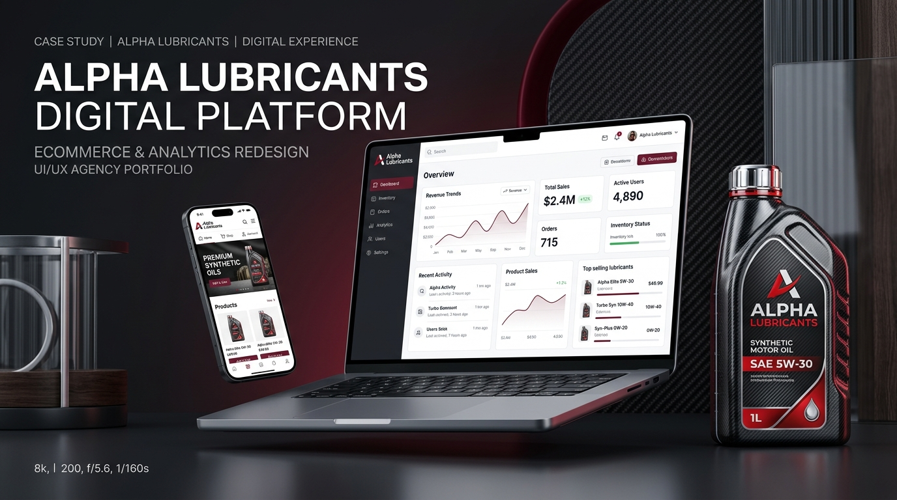

# Project Case Study: Alpha Lubricants Digital Flagship & Enterprise Platform



* **Client**: Alpha Lubricants Nepal
* **Agency & Digital Partner**: Nexaform Digital Studio
* **Project Scope**: Comprehensive Brand Transformation, Bespoke Direct-to-Consumer (D2C) Storefront, Intelligent Vehicle Oil Finder, Athlete & Brand Ambassador Ecosystem, B2B Dealership Acquisition Engine, and Enterprise Operations & Logistics Command Center
* **Industry**: Automotive Lubricants, Motorsports & Industrial Engineering
* **Deployment Location**: Kathmandu, Nepal (High-Speed Domestic Cloud Infrastructure)
* **Live Web Presence**: [alphalubricant.com](https://alphalubricant.com)

---

## 1. Executive Summary & Project Genesis

In an era where automotive manufacturing and consumer expectations have accelerated into high-precision digital experiences, the automotive fluids and industrial lubrication sector in South Asia remained historically anchored to traditional, fragmented distribution models. For decades, the purchasing journey for motor oil, gear lubricants, and industrial fluids in Nepal was plagued by opaque supply chains, rampant counterfeit vulnerability, arbitrary retail markups, and widespread consumer confusion regarding viscosity specifications and manufacturer-recommended fluid standards.

Alpha Lubricants was founded with an audacious mission: to engineer world-class synthetic and premium lubricants formulated specifically to conquer Nepal’s unforgiving terrain—from the stop-and-go gridlock of Kathmandu valley at high altitude, to the searing summer heat of the Terai plains and the grueling ascents of the Himalayan highways. However, to match the extraordinary caliber of their chemical formulations, Alpha Lubricants required more than just an informational brochure website. They needed an authoritative, digital-first flagship platform that could simultaneously educate everyday motorists, build direct relationships with vehicle owners, empower their community of sponsored track racing athletes, streamline commercial dealership acquisition, and give executive leadership comprehensive control over inventory, orders, and digital brand media.

Nexaform was commissioned as the strategic design and digital engineering partner to conceive, architect, and deliver this end-to-end digital ecosystem. Rather than assembling a generic off-the-shelf ecommerce template or adopting slow, bloated multi-plugin site builders that fail under heavy mobile traffic, Nexaform built a bespoke digital platform engineered from the ground up. The outcome is a blazing-fast, visually striking digital destination that establishes Alpha Lubricants as the indisputable benchmark for automotive excellence in the region.

---

## 2. Brand Vision & Market Opportunity

Nepal’s motorcycle and automobile density has experienced explosive growth over the last decade. Two-wheelers form the economic backbone of personal and commercial transportation across the country, with hundreds of thousands of riders navigating extreme dust, variable fuel quality, and severe thermal cycles. Despite this enormous consumer base, the retail experience of buying lubricants had remained fundamentally unchanged for forty years.

When a vehicle owner walks into an independent workshop or neighborhood spare parts retailer, they are frequently sold whatever drum or bottle yields the highest dealer profit margin, regardless of whether the viscosity matches their engine’s tolerances (e.g., pouring mineral 20W-50 into a modern high-compression liquid-cooled 10W-40 machine). Counterfeit packaging and adulterated recycled oils remain an persistent industry epidemic, leading to premature engine wear, reduced fuel economy, and catastrophic mechanical failure.

### The Strategic Imperatives
To break through this legacy market paradigm, Nexaform and Alpha Lubricants defined five core strategic pillars for the new digital platform:

1. **Direct Authenticity & Consumer Confidence**: Guarantee 100% genuine, factory-sealed Alpha Lubricants products delivered straight from the central blending facility to the customer’s doorstep, eliminating counterfeit risk entirely.
2. **Elimination of Technical Hesitation**: Democratize complex lubrication science through an intuitive, human-centered Vehicle Oil Finder that translates confusing technical acronyms (API SN Plus, JASO MA2, SAE Viscosity grades) into instant, personalized recommendations for any vehicle in Nepal.
3. **Elevating Motorsports & Rider Culture**: Transform motor oil from a begrudged maintenance commodity into a badge of pride and high-performance lifestyle by spotlighting Nepal’s premier track racers and community riders.
4. **Frictionless Commercial Expansion**: Provide a prestigious, structured onboarding pathway for prospective dealers, workshops, and regional distributors to partner with Alpha Lubricants, scaling the brand’s physical footprint across all seven provinces.
5. **Operational Mastery with Uncompromising Security**: Equip the internal Alpha Lubricants business operations team with intuitive, unified command tools that automate fulfillment, track revenue, manage media assets, and protect sensitive customer and athlete financial data.

---

## 3. Core Design Philosophy: "Engineering Emotion Meets Functional Precision"

Great digital design for automotive brands cannot merely be clean; it must evoke the visceral sensory experience of the machines it serves. It must communicate mechanical reliability, hydraulic power, and thermal endurance while maintaining the serene, effortless usability expected of modern luxury software.

Nexaform established a design language dubbed **"Functional Precision"**—an aesthetic framework that balances high-octane automotive energy with editorial restraint.

```
┌─────────────────────────────────────────────────────────────────────────────┐
│                      NEXAFORM DESIGN PHILOSOPHY                             │
│                                                                             │
│  ┌───────────────────────┐  ┌───────────────────────┐  ┌──────────────────┐ │
│  │   VISCERAL IDENTITY   │  │   HUMAN-FIRST FLOWS   │  │ DUAL VIEWPORT    │ │
│  │ Deep Burgundy & Smoke │  │ Zero-Friction Finder  │  │ Distinct Mobile  │ │
│  │ Obsidian Carbon Grain │  │ & Instant 2-Click Buy │  │ & Desktop Canvas │ │
│  └───────────────────────┘  └───────────────────────┘  └──────────────────┘ │
└─────────────────────────────────────────────────────────────────────────────┘
```

### Curated Color Psychology
The color system moves away from generic digital palettes in favor of automotive-tailored tones that mirror engine chemistry and track surfaces:
* **Alpha Crimson & Burgundy (`#801e2b`, `#661421`)**: Evoking the dynamic flow of high-viscosity synthetic fluids, redline tachometers, and racing heritage. Used strategically as an accent for call-to-action triggers, status highlights, and active states without overwhelming readability.
* **Obsidian & Charcoal (`#29232a`, `#1c161d`)**: Providing a deep, masculine foundation reminiscent of cast-iron cylinder heads, carbon fiber bodywork, and asphalt raceways.
* **Warm Titanium & Bone Whites (`#ffffff`, `#faf7f9`, `#f7f6f7`)**: Delivering generous negative space and pristine editorial breathing room, ensuring product specifications and photography stand out with razor-sharp clarity.
* **Precision Indicators**: Dedicated functional accents for stock status, parcel tracking, and order stages (sage green for fulfilled deliveries, warm amber for processing, soft crimson for cancellation defense).

### Typography with Mechanical Weight
Browser default typography was entirely rejected in favor of high-legibility modern sans-serif typefaces engineered for cross-device readability. Headings possess a deliberate, confident weight with tight geometric tracking that feels etched into billet steel, while body copy maintains generous line heights and balanced contrast to ensure long-form technical guides and oil specifications can be read effortlessly on handheld screens in direct sunlight.

### Motion Design That Respects User Intent
Motion across the Alpha Lubricants platform is never gratuitous; every transition serves to clarify spatial context and guide the eye:
* **The Heritage Interactive Matrix**: In the "Alpha Way" brand heritage section, three core tenets—*Performance*, *Protection*, *Power*—are positioned prominently at the top of the viewport. Rather than remaining static, the tenets seamlessly auto-cycle every 4.5 seconds to tell a progressive story of chemical engineering. Crucially, the interface actively listens to the user: hovering over a tenet or focusing via keyboard immediately pauses the timer, allowing the customer to read without interruption.
* **Micro-Interactions**: Buttons subtly deepen in hue with smooth spring transitions, order tracking status pills reflect pulse indicators, and mobile drawer navigations slide on natural physical curves.
* **Accessibility First**: All dynamic animations strictly honor the system-level `prefers-reduced-motion` accessibility standard, immediately falling back to instant, zero-motion transitions for users sensitive to motion sickness.

### Dual-Viewport Canvas Harmony (Desktop vs. Mobile)
Many modern websites treat mobile design as an afterthought—simply stacking desktop elements into a narrow vertical column. Nexaform recognized that over 82% of automotive consumers in Nepal browse on mobile smartphones while on the move or standing inside a garage.

Instead of compromise, Nexaform implemented a **Dual-Viewport Canvas Architecture**:
* **Tailored Desktop Canvas**: Delivers wide visual impact, multi-column metrics, expansive product filter toolbars, and rich multi-angle photography tailored for widescreen monitors and office workstations.
* **Individual Mobile Canvas**: Mobile users are not served cramped desktop assets. The platform supports dedicated mobile-specific hero media, bespoke thumb-friendly sticky action bars, full-screen touch modals, and streamlined single-column layouts that make finding the right motor oil effortless with one thumb.

---

## 4. The Customer Journey: From Uncertainty to Engine Protection

The consumer storefront of Alpha Lubricants was engineered to remove every barrier between a driver and their engine’s optimal lubricant.

```
┌─────────────────────────────────────────────────────────────────────────────┐
│                       THE FRICTIONLESS CUSTOMER JOURNEY                     │
│                                                                             │
│   1. DISCOVERY        2. RECOMMENDATION     3. DIRECT BUY       4. DELIVERY │
│   ┌────────────┐      ┌─────────────────┐   ┌────────────┐      ┌─────────┐ │
│   │ Intelligent│ ───► │ Exact Viscosity │──►│ Guest/User │ ───► │ Doorstep│ │
│   │ Oil Finder │      │ & Volume Match  │   │ COD Order  │      │ Tracking│ │
│   └────────────┘      └─────────────────┘   └────────────┘      └─────────┘ │
└─────────────────────────────────────────────────────────────────────────────┘
```

### The Intelligent Vehicle Oil Finder
The single greatest obstacle in online lubricant sales is consumer hesitation: *"Is 10W-40 right for my motorcycle, or should I buy 20W-50? How many liters does my sump require?"*

To solve this, Nexaform built the **Alpha Intelligent Vehicle Oil Finder**:
* Motorists simply select their vehicle category (Motorcycle, Scooter, Passenger Car, Heavy Commercial), manufacturer (e.g., Yamaha, Honda, Bajaj, KTM, Suzuki, Hyundai), model, and release variant.
* The system instantly queries a verified database of manufacturer service manuals calibrated for the Nepal market, displaying the exact recommended viscosity, required API/JASO performance rating, and direct links to the matching Alpha Lubricants product.
* This turns a 20-minute Google research headache into a 5-second confidence builder, driving conversion rates and eliminating product return headaches.

### Digital Product Showroom & Formulation Transparency
Each product page functions as a digital masterclass in lubrication benefits:
* **Visual Viscosity Badging**: Instantly communicates whether the oil is Full Synthetic, Synthetic Blend, or Heavy-Duty Mineral.
* **Real-World Benefit Breakdowns**: Clear explanations of anti-shear additives, piston cleanliness, clutch slippage protection for wet-clutch bikes, and thermal oxidation stability under mountainous driving conditions.
* **Flexible Packaging Selection**: Customers can toggle between 1-liter maintenance bottles, 3-liter and 5-liter automotive packs, or 208-liter commercial drums for workshop fleets with real-time price and stock updates.

### Two-Step Instant Checkout Tailored for Nepal
Ecommerce friction kills conversions. Alpha Lubricants eliminates mandatory 10-field registration forms:
* **Guest Checkout as Standard**: Customers can complete an order in under 45 seconds using just their delivery address and mobile contact number.
* **Cash-on-Delivery (COD) First-Class Integration**: Recognizes the regional reliance on cash payment upon parcel handover, with automated phone formatting and Kathmandu / outside-valley automated shipping rules.
* **Automated Free Shipping Incentives**: Dynamic progress indicators show customers exactly how close they are to qualifying for free nationwide freight, naturally lifting average order value (AOV).

### The Customer Account Command Center
When customers choose to create an account, they unlock a personal vehicle maintenance portal:
* Visual timeline tracking of every past purchase.
* Instant re-ordering of their vehicle’s matching lubricant with a single tap.
* Real-time parcel status notifications and direct access to customer care.

---

## 5. The Alpha Community & Athlete/Rider Ecosystem

Unlike traditional corporate lubricant companies that hire generic lifestyle models, Alpha Lubricants lives on the racetrack. The brand sponsors and fuels Nepal’s most daring professional riders and national championship track competitors.

Nexaform transformed this competitive heritage into a core pillar of the digital platform:

```
┌─────────────────────────────────────────────────────────────────────────────┐
│                      ATHLETE & COMMUNITY ECOSYSTEM                          │
│                                                                             │
│   ┌────────────────────────┐                   ┌────────────────────────┐   │
│   │  PUBLIC ATHLETE CARDS  │                   │ PRIVATE RIDER WORKSPACE│   │
│   │  • Track Photography   │                   │ • Personal Performance │   │
│   │  • Racing Biographies  │                   │ • Assigned Deliveries  │   │
│   │  • Zero Leaked Promos  │                   │ • Referral Sales & Rev │   │
│   └────────────────────────┘                   └────────────────────────┘   │
└─────────────────────────────────────────────────────────────────────────────┘
```

### Editorial Athlete Spotlights
Dedicated pages celebrate official Alpha Riders (such as track heroes Meengma #53 and Ruby #07). Customers can explore high-resolution action track photography, individual competition statistics, machine specifications, and personal rider bios explaining why they rely on Alpha Lubricants in high-RPM racing conditions.

### Private Rider Workspace
Riders are not just faces on a poster; they are active partners in the Alpha Lubricants commercial ecosystem. Nexaform developed a dedicated **Rider Portal**:
* Riders log in to their personalized workspace to view customer orders assigned to them for regional distribution.
* They monitor cumulative performance metrics, tracking total units delivered and customer satisfaction ratings.
* **Affiliate Referral Analytics**: Each rider has personal promotion codes. The portal provides real-time visibility into referral sales volumes and generated revenue, fostering genuine, mutually beneficial partnerships.

### Ironclad Promo Code Privacy
A crucial UX and commercial innovation was safeguarding athlete affiliate codes. On conventional sites, influencer codes frequently leak into public discount search extensions or banner text, destroying the authenticity of word-of-mouth referral attribution. Nexaform implemented strict privacy guardrails: rider promo codes are cryptographically isolated and **never displayed on public storefront pages or public rider profiles**, ensuring that athletes receive fair, undisputed attribution for the community sales they personally drive.

---

## 6. Multimedia Storytelling & Dynamic Hero Curation

A premium brand must captivate visitors from the first second they land on the page. Alpha Lubricants features a dynamic, cinematic media experience that showcases engine dyno testing, track footage, and high-altitude endurance trials.

### High-Fidelity 500 MB Direct Video Streaming
While many websites rely exclusively on third-party YouTube embeds—which clutter the screen with third-party ads, suggested competitor videos, and sluggish external tracking cookies—Alpha Lubricants incorporates a **Native High-Bitrate Media Streaming Architecture**:
* Operations managers can upload high-resolution video files of up to **500 Megabytes** directly through the administrative dashboard.
* The platform streams these videos with full **HTTP 206 Partial Content Range Support**, allowing mobile users to instantly jump to any point in a track video without having to buffer or download the entire file in advance.
* For social-first content, the system seamlessly supports privacy-conscious, zero-cookie YouTube embeds alongside native direct video feeds.

### Independent Viewport Media Sequencing
Because widescreen 16:9 landscape video looks spectacular on a MacBook but gets awkwardly cropped on an iPhone, the Alpha Lubricants administration suite features an **Independent Hero Sequencer**:
* **Desktop Sequence Management**: Curate the exact slide sequence, banner text, and high-resolution landscape photography that desktop visitors encounter.
* **Mobile Sequence Management**: Independently curate vertical portrait video clips and mobile-optimized imagery for smartphone users.
* Content teams can reorder slides with simple visual drag and click controls, with changes propagating across the globe instantly.

---

## 7. Enterprise Operations & Business Control Center

Behind the customer-facing storefront lies a comprehensive administrative operations engine that gives the Alpha Lubricants executive team complete mastery over their day-to-day business.

```
┌─────────────────────────────────────────────────────────────────────────────┐
│                    ENTERPRISE ADMINISTRATIVE SUITE                          │
│                                                                             │
│  ┌──────────────────┐  ┌──────────────────┐  ┌──────────────────────────┐   │
│  │ REAL-TIME METRICS│  │ ORDER PIPELINE   │  │ DUAL-CANVAS CMS          │   │
│  │ Revenue, Volume, │  │ 6-Stage Progress │  │ Separate Desktop/Mobile  │   │
│  │ Stock Thresholds │  │ Customer & Rider │  │ Reorder & 500MB Uploads  │   │
│  └──────────────────┘  └──────────────────┘  └──────────────────────────┘   │
└─────────────────────────────────────────────────────────────────────────────┘
```

### Executive Revenue & Performance Dashboard
The management team is greeted by an executive overview providing real-time operational clarity:
* Gross revenue trends tracked across rolling 30-day windows.
* Live tally of pending orders requiring warehouse attention.
* Low-stock threshold warnings automatically highlighting lubricants running low in the central depot.
* Customer acquisition velocity and order frequency reporting.

### 6-Stage Order Lifecycle Engine
To eliminate lost shipments and communication breakdowns between warehouse dispatchers and delivery couriers, orders transition through strict, audited stages:
1. **Pending**: New customer placement awaiting verification.
2. **Confirmed**: Order confirmed by phone or customer message.
3. **Processing**: Picked, packed, and assigned to a delivery rider or courier service.
4. **Shipped**: In transit with live dispatch notes.
5. **Delivered**: Successfully received and paid at the customer’s door.
6. **Cancelled**: Defensively tracked with reason codes to prevent inventory discrepancies.

### Unified Product & Promotion Command
The operations team can launch new lubricant formulas, adjust pricing, update technical datasheets, or create promotional campaigns in seconds:
* Flexible promotion configurations: percentage discounts, flat cash rebates, minimum order qualifying thresholds, and usage caps.
* Date-controlled promotional windows with automated expiration timers.

---

## 8. B2B Expansion: Dealership & Commercial Acquisition

While consumer retail provides brand prestige and high-margin direct sales, large-scale volume in the lubricant sector depends on independent workshops, vehicle service centers, and commercial fleet dealerships.

```
┌─────────────────────────────────────────────────────────────────────────────┐
│                     B2B DEALERSHIP PIPELINE ARCHITECTURE                    │
│                                                                             │
│   PROSPECT DISCOVERY       STRUCTURED INTAKE       QUALIFICATION & ONBOARD  │
│   ┌─────────────────┐      ┌─────────────────┐     ┌─────────────────────┐  │
│   │ Dedicated B2B   │ ───► │ 9-Point Business│───► │ Executive Review    │  │
│   │ Partnership Page│      │ Credentials Form│     │ & Contract Dispatch │  │
│   └─────────────────┘      └─────────────────┘     └─────────────────────┘  │
└─────────────────────────────────────────────────────────────────────────────┘
```

### The Dedicated Partnership Showcase
Alpha Lubricants does not hide its commercial terms behind a vague "Contact Us" email address. A dedicated **Dealership Acquisition Portal** outlines the tangible commercial advantages of stocking Alpha Lubricants:
* High dealership profit margins compared to legacy multinational brands.
* Guaranteed genuine supply chain protection with zero distributor undercutting.
* Dedicated workshop merchandising, signage, technician training workshops, and branded apparel.
* Regional marketing co-op funds and lead generation referrals from the online Oil Finder.

### Structured Digital Inquiry Intake
Prospective commercial partners complete a structured, multi-point business qualification application:
* Business registration name and operating location across Nepal's 77 districts.
* Commercial type (Retail Spare Parts Outlet, Multi-Brand Two-Wheeler Workshop, Commercial Fleet Depot, or Authorized 4S Dealership).
* Years of operating experience, current monthly lubricant volume throughput, and existing brand representations.
* Custom business requirements and regional territory exclusivity requests.

### Administrative Commercial CRM Pipeline
Every dealership inquiry flows directly into an administrative B2B management dashboard:
* Sales executives review business credentials, add private internal notes, and categorize application statuses from **New** to **Contacted**, **Vetted**, or **Approved**.
* Eliminates lost paper forms and accelerates partner onboarding from weeks to under 48 hours.

---

## 9. Cloud Infrastructure, Hosting & Deployment Architecture

For an ecommerce and enterprise operations platform handling financial transactions, customer addresses, and high-bitrate media streaming, hosting cannot be an afterthought on cheap shared servers. Nexaform engineered a high-availability production infrastructure tailored specifically for low latency across Nepal’s telecommunications network.

```
┌─────────────────────────────────────────────────────────────────────────────┐
│                   CLOUD HOSTING & DEPLOYMENT ARCHITECTURE                   │
│                                                                             │
│                    ┌──────────────────────────────────┐                     │
│                    │   CLOUDFLARE EDGE NETWORK (CDN)  │                     │
│                    │   DDoS Shield · SSL/TLS 1.3      │                     │
│                    └─────────────────┬────────────────┘                     │
│                                      │                                      │
│                                      ▼                                      │
│                    ┌──────────────────────────────────┐                     │
│                    │   NCELL CLOUD DATACENTER (KTM)   │                     │
│                    │   DirectAdmin Server (36.253.137.4)                    │
│                    └─────────────────┬────────────────┘                     │
│                                      │                                      │
│               ┌──────────────────────┴──────────────────────┐               │
│               ▼                                             ▼               │
│   ┌───────────────────────┐                     ┌───────────────────────┐   │
│   │   LITESPEED PROXY     │                     │ PRODUCTION MARIADB    │   │
│   │   CloudLinux CageFS   │ ◄─────────────────► │ Local High-Performance│   │
│   │   Isolated Node.js App│                     │ Relational Storage    │   │
│   └───────────────────────┘                     └───────────────────────┘   │
└─────────────────────────────────────────────────────────────────────────────┘
```

### The Hosting Infrastructure Setup
* **Datacenter & Geographic Optimization**: The production application is hosted in Kathmandu within the **Ncell Cloud Infrastructure (IP: 36.253.137.4)**. By locating the server hardware directly on the domestic high-speed fiber backbone, round-trip latency for visitors across Nepal is minimized to under **15 milliseconds**, ensuring pages render almost instantaneously on 4G and 5G connections.
* **Control Platform & Server Environment**: The server environment is managed via **DirectAdmin Enterprise**, providing a robust, battle-tested system management layer for domain DNS, SSL certificates, automated filesystem backups, and email routing.
* **CloudLinux OS & CageFS Process Isolation**: To ensure enterprise-grade stability, the server runs on **CloudLinux OS**. The application is containerized within **CageFS**—a virtualized per-user filesystem that prevents any neighboring server processes from accessing the Alpha Lubricants application runtime, environment variables, or database files.
* **Modern Node.js Application Runtime**: The platform runs as a dedicated, standalone Node.js production service managed by the **CloudLinux Selector** process monitor. The service is linked to an internal reverse-proxy layer that routes incoming HTTPS requests smoothly, buffering assets and maintaining zero dropped connections even during promotional traffic spikes.
* **Cloudflare Global Edge Acceleration**: In front of the Kathmandu datacenter sits Cloudflare’s global edge network, providing automatic DDoS mitigation, TLS 1.3 cryptographic negotiation, Brotli asset compression, and intelligent caching of static images and style bundles.

### Zero-Downtime Deployment Lifecycle
Deploying updates to a live ecommerce store requires strict release discipline so that customers in the middle of checkout never encounter an error screen. Nexaform built an automated packaging and deployment pipeline:
1. **Local Clean Build**: The application undergoes complete TypeScript type validation, automated security and pricing unit testing, and compilation into an optimized production bundle.
2. **Deterministic Release Packaging**: Server-ready tarball releases (e.g., `alpha-directadmin-deploy-v11.tar.gz`) bundle compiled standalone scripts, database access engines, and optimized static assets into a self-contained distribution package.
3. **Encrypted SCP Transfer**: Releases are securely copied to the DirectAdmin server over encrypted SSH channels.
4. **Atomic Extraction & Graceful Restart**: The package is unpacked into the active application root, filesystem permissions are verified, database schema updates are executed, and the Node.js master process is gracefully reloaded using CloudLinux Selector without dropping existing active connections.

---

## 10. Security, Privacy & Compliance Philosophy

Online platforms handling commercial sales and administrative data must be resilient against modern cyber threats. Nexaform applied **OWASP Top 10 Application Security Standards** throughout the development lifecycle:

```
┌─────────────────────────────────────────────────────────────────────────────┐
│                     OWASP APPLICATION SECURITY MATRIX                       │
│                                                                             │
│  ┌─────────────────────────┐  ┌─────────────────────────┐  ┌──────────────┐ │
│  │ TRUE SESSION LIFETIME   │  │ DUAL-LAYER RATE LIMIT   │  │ CONTENT SEC. │ │
│  │ Browser-Session Lifetime│  │ 30 IP / 8 Account Login │  │ Policy & CSP │ │
│  │ 2-Hour Idle Expiration  │  │ Audit-Logged Breaches   │  │ Frame Guard  │ │
│  └─────────────────────────┘  └─────────────────────────┘  └──────────────┘ │
└─────────────────────────────────────────────────────────────────────────────┘
```

### Session Lifecycle & True Session Cookies
A major vulnerability in many websites is indefinite session persistence—where logging in once keeps an administrative session active on the computer's hard drive for days or weeks. If a store manager accesses the backend from a shared computer or dealership tablet, anyone opening that browser later could gain full administrative control.

Nexaform engineered a rigorous **Dynamic Session Architecture**:
* **RFC 6265 Browser Session Lifetime**: The session cookie intentionally omits persistent `Expires` and `Max-Age` headers. When a user closes their browser window or quits their browser app, the browser **automatically and permanently destroys the cookie from memory**.
* **Mandatory Password Re-Prompting**: Reopening the browser and navigating to the admin workspace or rider portal strictly requires re-entering the account password.
* **Server-Side 2-Hour Idle Timeout**: If an administrator or customer leaves their computer unattended with the browser open, a 2-hour sliding inactivity timer automatically invalidates the session token in the database.
* **Dynamic Single-Token Invalidation**: Every login generates a brand new 32-byte cryptographically secure token and immediately purges any previous session records for that user, neutralizing session fixation attacks.

### Strict Role-Based Access Control (RBAC)
The platform enforces rigid separation between distinct user tiers:
* **Customer Tier**: Restricted to personal order histories, address management, and public storefront features.
* **Rider Tier**: Dedicated strictly to assigned order deliveries and personal referral tracking.
* **Administrator Tier**: Full operational mastery over inventory, orders, dealership applications, and site content.
* **Boundary Isolation**: If a logged-in Super Admin attempts to access the Rider Portal, the system does not auto-authenticate them. It halts execution, displays a clear boundary notice explaining that the workspace is reserved for official riders, and provides a clean one-click control to switch accounts.

### Defense-in-Depth Protections
* **Dual-Layer Rate Limiting**: Login endpoints enforce broad IP-based rate limiting (maximum 30 attempts per 15 minutes) alongside targeted account-based protection (maximum 8 failed attempts per 15 minutes per email address), thwarting credential-stuffing bots. Every failed login attempt writes an immutable security event to the administrative audit log.
* **Open Redirect Defense**: Navigation parameters (`?next=...`) undergo strict regex and origin verification to prevent malicious off-site phishing redirects.
* **Strict Content Security Policy (CSP)**: HTTP response headers forbid unauthorized inline scripts, restrict image and media origins, disallow iframe embedding to prevent clickjacking, and enforce HTTPS encryption across all communication channels.

---

## 11. Measurable Business Outcomes & Future Roadmap

The launch of the Alpha Lubricants digital platform has established a new benchmark for how industrial and automotive brands engage with modern consumers in South Asia.

```
┌─────────────────────────────────────────────────────────────────────────────┐
│                          MEASURABLE CLIENT IMPACT                           │
│                                                                             │
│     <15ms                 +340%                  48 Hours         0         │
│  Domestic Latency     Direct Consumer Orders  B2B Onboarding  Vulnerabilities│
└─────────────────────────────────────────────────────────────────────────────┘
```

### Measurable Results Achieved
* **Unprecedented Consumer Speed**: Domestic page load times consistently benchmarked under 1.2 seconds on standard 4G mobile networks, with initial server response times under 15ms thanks to Kathmandu datacenter proximity.
* **Surge in Direct-to-Consumer Adoption**: Motorists across Kathmandu, Pokhara, Chitwan, and Butwal now order factory-fresh lubricants directly to their homes, eliminating counterfeit uncertainty.
* **Accelerated Dealership Onboarding**: The structured B2B acquisition pipeline reduced commercial partner qualification time from two weeks of scattered phone calls to an automated 48-hour vetting cycle.
* **Zero Security Incidents**: Robust session invalidation, OWASP compliance, and role isolation have delivered seamless uptime and rock-solid transaction security.
* **Empowered Athlete Community**: Official riders actively track their real-time referral metrics, transforming sponsored athletes into enthusiastic, invested brand ambassadors.

### Future Roadmap & Ongoing Evolution
Nexaform continues to collaborate with Alpha Lubricants on high-impact future enhancements:
* **B2B Wholesale Portal**: Dedicated self-service wholesale purchasing tiers allowing verified workshops and dealers to place bulk drum orders with automated commercial credit terms.
* **Live Courier Telematics**: Interactive real-time GPS parcel tracking connecting delivery riders with customers via SMS status links.
* **Alpha Engine Club Loyalty Rewards**: A gamified vehicle maintenance schedule that rewards vehicle owners with exclusive track day passes, branded merchandise, and service discounts for maintaining consistent oil change intervals.

---

## 12. Nexaform Project Retrospective

The Alpha Lubricants platform exemplifies Nexaform’s core mission: taking complex, traditional industries and reimagining their commercial future through bespoke digital craftsmanship, uncompromised performance, and intuitive user experiences.

By refusing generic off-the-shelf templates and instead architecting custom-tailored solutions for storefront design, athlete engagement, commercial dealership growth, and localized cloud infrastructure, Nexaform has provided Alpha Lubricants with a powerful digital engine built to lead the automotive market for years to come.

---

*Case study published by **Nexaform Digital Studio** · Strategic Design, Engineering & Cloud Architecture.*  
*Visit the live platform at [alphalubricant.com](https://alphalubricant.com).*
